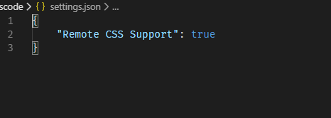

# css-class-intellisense README

css class智能提示。

## Features

当**打开**或者**保存**html文件时会检测你引入的css文件并对class进行智能提示，包括本地和远程文件。  
When you **open** or **save** the HTML file, the CSS files you linked will be automatically detected, including local and remote files.

## Instructions

默认关闭远程CSS支持，要开启该功能需要进行设置。  
Remote CSS support is off by default. You can enable it by setting "Remote CSS Support" to `true`.

## Release Notes

### 0.1.0

对外部引入的css文件提供class智能提示。  
Class Intellisense for linking CSS.

### 0.2.0

智能提示内嵌CSS。  
Class Intellisense for embedding CSS.

### 1.0.0

将远程css文件下载到本地，提高提示的流畅度。  
Improve the fluency of Intellisense by download remote CSS files to local.

### 1.1.0

提供远程css支持选项设置  
Provide remote CSS support option setting.
