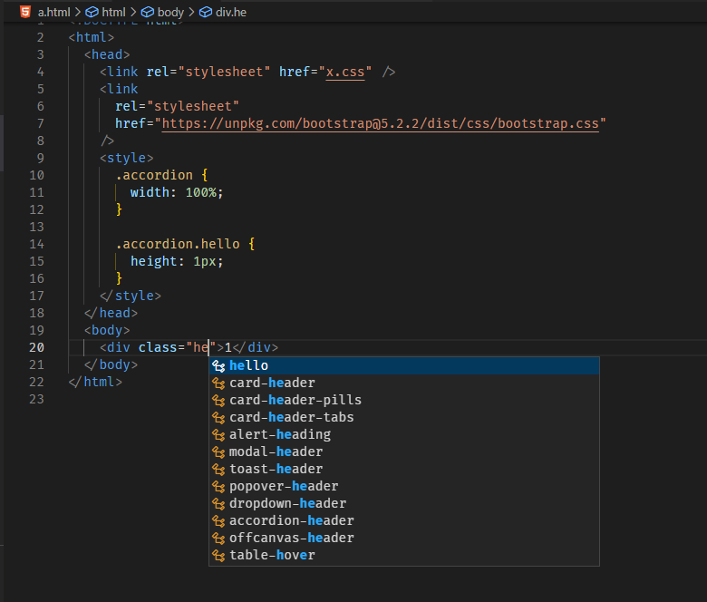
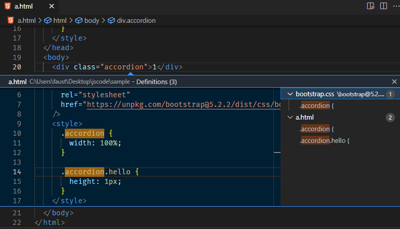
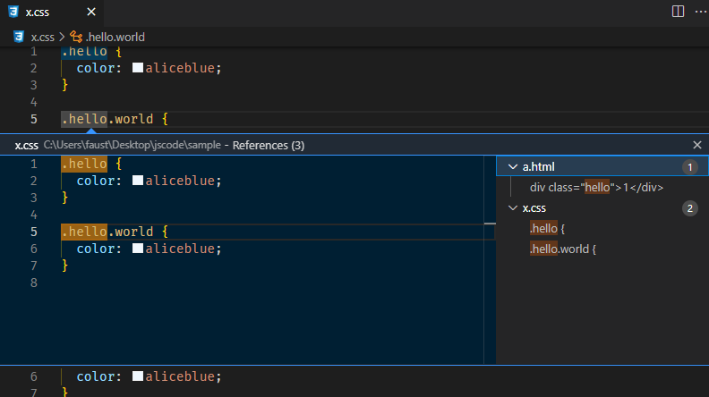

# css-class-intellisense

Html/Vue class attribute completion

## Features

- Html/Vue class attribute completion (Include Vue imported CSS file)
- Jump to definition or reference
- Rename (May conflict with other extensions, currently can not be resolved, use with caution)

## Usage

### completion

### definition

### reference

