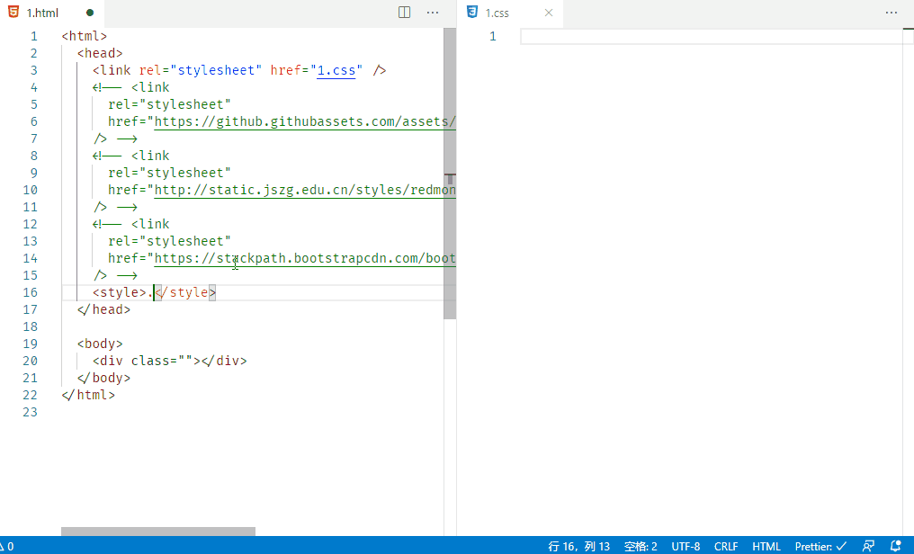

# css-class-intellisense

CSS Class 智能提示。

## Features

实时监测 HTML 文件，对引入的 CSS 文件进行智能提示，包括本地和远程文件。  
Watch HTML file in real time and give intellisense.

## Instructions

默认关闭远程 CSS 缓存，要开启该功能需要进行设置。  
Remote CSS Cache is off by default. You can enable it by setting "Remote CSSCache Path".

## Release Notes

### 2.0.2

electron 更新至 7.1.11  
update electron to 7.1.11

### 2.0.1

缩小插件体积。  
Reduce the size.

### 2.0.0

使用 **tree-sitter** ，实时监测文件更改。  
Use **tree-sitter** to watch file changes in real time.

### 1.1.0

提供远程 css 支持选项设置。  
Provide remote CSS support option setting.

### 1.0.0

将远程 css 文件下载到本地，提高提示的流畅度。  
Improve the fluency of Intellisense by download remote CSS files to local.

### 0.2.0

智能提示内嵌 CSS。  
Class Intellisense for embedding CSS.

### 0.1.0

对外部引入的 css 文件提供 class 智能提示。  
Class Intellisense for linking CSS.
