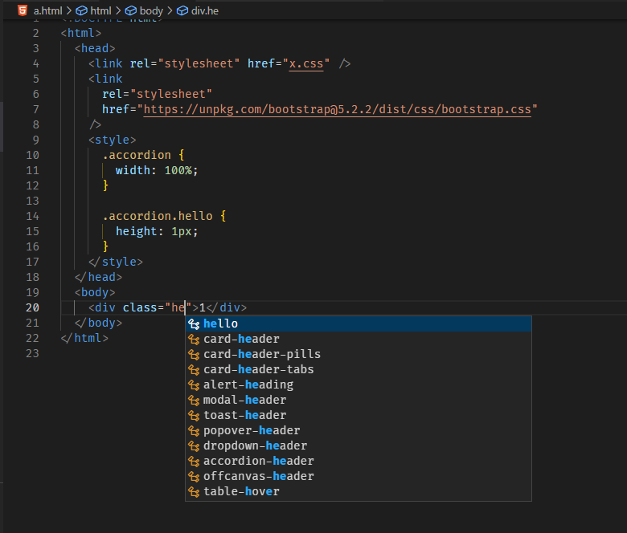
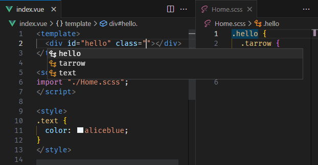
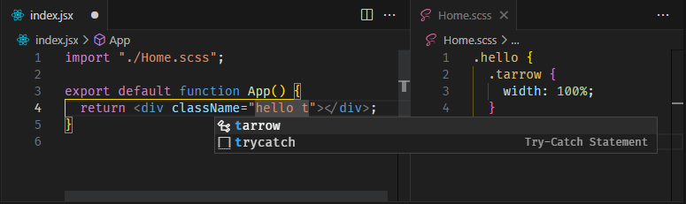

# css-class-intellisense

Html/Vue/Jsx id/class attribute completion

## Features

- Html/Vue/Jsx id/class attribute completion (Include Vue/Jsx imported CSS/SCSS/LESS file)
- Jump to definition or reference
- Rename (May conflict with other extensions, cannot currently be resolved, use with care)
- Limited language support for web extensions ([issues](https://github.com/microsoft/vscode-test-web/issues/4))

## Usage

### completion(html)

### completion(vue)

### completion(jsx)

### definition

### reference

